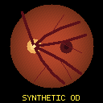
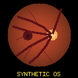

# LongiEye AI Platform

LongiEye 是一个面向作品集的、隐私优先的纵向近视风险建模工程示例。它把硕士论文中的纵向临床建模思路整理成清晰的领域模型、特征管道、可替换推理后端和 FastAPI 服务。

> 当前 `v0.4.0` 的公开 API 仍仅使用确定性生成的合成数据训练演示模型。输出不是医疗结论，不能用于诊断、筛查或治疗决策。


## 为什么值得放进作品集

- 研究来源边界已记录：公开特征合同与私有证据登记分离；完整追溯信息须在获批的 Phase B 受控登记中建立。
- 工程边界清楚：领域校验、特征提取、模型推理和 API 分层实现。
- 结果不夸大：公开 HTTP 返回值都标记为 `demo_synthetic`，离线多模态结果另标 `demo_multimodal_synthetic`；真实研究指标与演示模型指标分开陈述。
- 可持续演进：后续可以替换为真实交叉验证模型、图像分支和监控组件。

## 当前功能

- Y1/Y2 两次随访数据校验。
- “静态性别编码 + 8项纵向变化量”特征提取。
- 纯 Python 合成数据和双眼逻辑回归演示模型训练。
- OD/OS 双目标风险演示接口。
- FastAPI `/health`、`/ready` 与 `/predict` 端点。
- 统一错误响应、端到端请求 ID 和隐私安全的 JSON 日志。
- P50/P95/P99、顺序吞吐量、进程 RSS 与 Python 峰值内存基准。
- 严格 canonical PNG 解码、合成眼底图质控、确定性图像编码与逐眼安全回退。
- 145 项测试（含可选 PyTorch 适配测试）、锁定依赖，以及已配置的 Dockerfile 和 GitHub Actions CI。

## Sprint 3：全合成多模态扩展

Sprint 3A 已实现一条独立的离线多模态路径：现有九维纵向结构化模型提供锚点分数，两张代码生成的 OD/OS 合成眼底示意图经过完整性绑定、质量门和确定性统计编码器，再产生最大绝对值为 `0.35` 的逐眼 logit 修正。图像缺失或质控失败时，该眼逐值精确回退到原结构化结果。

| 全合成 OD fixture | 全合成 OS fixture |
| --- | --- |
|  |  |

两张图都由固定整数绘图规则生成并带有 `SYNTHETIC OD/OS` 水印，不来自患者或医学数据集。CI guardrail 通过扩展名、常见文件头和精确摘要拒绝其他影像或容器工件；它用于降低误提交风险，但不等同于内容识别 DLP。

多模态功能不会改变公开 `/predict`：HTTP 仍只接收结构化 Y1/Y2 JSON，`images`、图像路径、URL 和 Base64 字段都会被拒绝。离线 adapter 使用 `demo_multimodal_synthetic` stage，因此也无法被现有 `RiskPredictionService` 静默装入公开服务。详细边界见[全合成多模态 Demo Card](docs/MULTIMODAL_DEMO_CARD.md)。

## Sprint 2：研究模型适配边界

Sprint 2 的目标是证明“用于接入经授权研究模型”的 adapter、manifest、完整性校验和黄金向量自检流程可以运行。当前没有转换或部署真实研究 checkpoint；公开服务的非临床语义保持不变。

Phase A 的实现与 GitHub Actions 验证均已完成。Phase B 仍因真实工件未授权而关闭。

研究工件的默认状态是 **未授权**。公开仓库不得包含真实 checkpoint、预处理统计、受试者记录、拆分 ID、逐人预测或 OOF 输出。即使本地存在经过授权的研究工件，公开 `/predict` 仍只运行合成 JSON 模型；研究适配与比较在隔离的离线路径中完成。

| 组件 | 当前/目标状态 | 是否进入公开仓库 | 是否由公开 API 使用 |
| --- | --- | --- | --- |
| 合成 JSON 模型 | 当前启用、完全可复现 | 是 | 是 |
| `RiskModelBackend` 协议 | Phase A 公共适配基础 | 是 | 仅约束内部后端 |
| `ResearchModelAdapter` | Phase A 公共 adapter 与严格校验 | 是，不含真实权重 | 否 |
| 内部 `_TorchStateDictRuntime` | Phase A 惰性可选 PyTorch runtime；只能由已验证研究包构造，默认安装不要求 torch | 是 | 否 |
| 合成 PyTorch state dict | CI/pytest 运行时临时生成 | 否；仅生成逻辑与测试代码公开 | 否 |
| 真实研究工件 | Phase B，默认未授权 | **否** | **未启用** |
| 临床有效性与真实世界部署 | 未建立 | 不适用 | 不允许 |

### 作品集证据索引

| 能力主张 | 可审计证据 | 边界 |
| --- | --- | --- |
| 可复现合成服务 | [公开合成模型卡](docs/MODEL_CARD.md)、测试与基准报告 | 只证明工程链路 |
| 研究证据链设计 | [研究来源与隐私边界](docs/RESEARCH_PROVENANCE.md) | 私有 commit 与证据位置必须留在受控登记中 |
| 工件加载受控 | [研究工件授权清单](docs/RESEARCH_ARTIFACT_AUTHORIZATION.md) | 包不能自我批准；需包外审批策略与绑定回执 |
| 研究模型说明规范 | [研究模型卡模板](docs/RESEARCH_MODEL_CARD_TEMPLATE.md) | 未填完和未批准时不得发布指标或工件 |
| Adapter 合同与合成等价性 | 多黄金向量、checksum/shape/dtype/NaN 失败测试和 comparison builder | 合成 fixture 不能证明真实 checkpoint 已转换 |
| 已加载 adapter 计时能力 | 严格分区 comparison builder 的顺序 P50/P95/P99 | 通用 builder 本身不验证授权；标准 CLI 先通过包门禁。尚无真实 PyTorch 报告，不含冷加载、RSS 或生产 SLA |
| 全合成多模态工程 | canonical PNG、OD/OS 像素摘要、质量门、参考 encoder、逐眼回退测试和聚合基准 | 没有真实图像、CNN 训练或多模态效果主张 |
| 学术研究结果 | 固定 commit、聚合结果文件和论文表格的逐项映射 | 与合成 AUC、adapter 指标严格分开 |

## 快速开始

```powershell
python -m pip install -r requirements.lock
python -m pip install --no-deps -e .
python -m pytest -q
uvicorn app.main:app --reload
```

默认轻量环境预期会跳过需要 PyTorch 的5项专项测试；当前基线为 `140 passed, 5 skipped`。安装研究适配依赖后的完整基线为 `145 passed`。GitHub 的独立 research-adapter job 会要求这些测试真实运行，无法导入 Torch 时直接失败。

访问 `http://127.0.0.1:8000/docs` 查看中文接口说明，或发送示例请求。HTTP 路径和 JSON 字段名保留英文，以维持稳定的机器合同：

```powershell
Invoke-RestMethod -Method Post `
  -Uri http://127.0.0.1:8000/predict `
  -ContentType application/json `
  -InFile examples/request.json
```

也可以直接运行不依赖 Web 框架的命令行演示：

```powershell
python scripts/run_demo.py --human
```

默认不加 `--human` 时仍输出适合程序解析的原始 JSON。

运行全合成多模态演示与回退场景：

```powershell
python scripts/generate_synthetic_fundus.py --check
python scripts/run_multimodal_demo.py --scenario both --human
python scripts/run_multimodal_demo.py --scenario missing-os --human
python scripts/run_multimodal_demo.py --scenario missing-both --human
```

这条路径仅在仓库内离线运行，不会启动图像上传 API，也不会读取任意外部图片。

Sprint 2 的公开 manifest 模板可以在完全不读取 checkpoint 的情况下校验：

```powershell
python scripts/validate_research_manifest.py
python scripts/check_public_artifacts.py
```

独立的 GitHub Actions 任务会安装 `requirements.research.lock` 中的 CPU-only PyTorch 2.13.0，并在临时目录生成合成 state dict，验证 manifest、SHA-256、预处理、OD/OS 映射和失败路径。该依赖不会进入默认安装或 Docker 镜像。

如需在本机运行同一组可选测试：

```powershell
python -m pip install -r requirements.research.lock
$env:LONGIEYE_REQUIRE_TORCH = "1"
python -m pytest -q tests/test_model_contract.py tests/test_research_adapter.py tests/test_comparison.py
```

仓库已包含可运行的合成模型制品（artifact）；启动服务不需要重新训练。要验证模型生成的确定性，可运行：

```powershell
python scripts/train_demo_model.py
```

## 项目结构

```text
app/                 FastAPI 入口
configs/             可审阅的演示模型配置与未授权 research manifest 模板
docs/                架构、研究来源与后续路线
examples/            脱敏请求与两张固定全合成眼底 fixture
scripts/             合成训练、图像生成、工件检查、离线演示与基准脚本
src/longieye/        领域、特征、模型合同、图像/融合 adapter 和服务代码
tests/               核心单元测试
```

## API 示例

请求包含两个固定相隔12个月的随访时间点。接口没有姓名、证件号、受试者编号或图像路径字段，任何额外字段都会被拒绝。可选 `case_id` 只允许非识别性别名，调用方不得在其中放入个人信息。

```json
{
  "case_id": "demo-001",
  "followup_months": 12,
  "y1": {
    "sex_code": 0,
    "height_cm": 145.0,
    "weight_kg": 38.0,
    "sbp_mmhg": 105.0,
    "dbp_mmhg": 68.0,
    "waist_cm": 62.0,
    "wears_glasses": 0,
    "axial_length_od_mm": 23.50,
    "axial_length_os_mm": 23.45
  },
  "y2": {
    "sex_code": 0,
    "height_cm": 151.0,
    "weight_kg": 43.0,
    "sbp_mmhg": 108.0,
    "dbp_mmhg": 70.0,
    "waist_cm": 65.0,
    "wears_glasses": 1,
    "axial_length_od_mm": 23.82,
    "axial_length_os_mm": 23.74
  }
}
```

## 隐私与用途边界

- 不提交真实临床表格、受试者标识、图像路径、模型权重或逐人预测。
- 不提交真实眼底图、任意栅格图像或医学影像；固定 fixture 必须与生成器和摘要 registry 一致。
- 演示模型只证明软件工程流程，不复现论文中的研究性能。
- 离线 Phase B parity 前必须完成所有权、隐私与工件使用授权。
- 任何公开或临床路径启用还必须另行完成外部验证、校准、偏倚分析和临床治理。

详细说明见 [研究来源](docs/RESEARCH_PROVENANCE.md) 与 [架构设计](docs/ARCHITECTURE.md)。

## Sprint 1 本机基准

基准环境为 Python 3.12.13 / Windows 11；结果来自同进程顺序调用，不包含网络、反向代理、容器或并发负载。

| 路径 | 迭代 | P50 | P95 | P99 | 顺序吞吐量 |
| --- | ---: | ---: | ---: | ---: | ---: |
| 核心服务（core_service） | 5,000 | 0.009 ms | 0.015 ms | 0.020 ms | 99,169.4 req/s |
| 进程内 ASGI（in_process_asgi） | 500 | 2.497 ms | 3.902 ms | 4.704 ms | 371.5 req/s |

完整的环境、内存定义和限制见 [基准报告](benchmarks/latest.md)。这些是合成模型的工程指标，不是医疗效果指标。

## Sprint 3 多模态回退基准

`benchmarks/multimodal_latest.md` 分别测量双眼合成图像、缺失 OS 和双眼缺失三种离线路径。计时包含质控、32×32 预处理、确定性统计编码和有界融合，不包含文件读取，也不保存图像、路径、embedding 或逐例分数。

完整结果见[全合成多模态基准](benchmarks/multimodal_latest.md)。这些数字只表示本机工程开销，不是多模态模型效果或临床性能。

## 进一步阅读

- [模型卡](docs/MODEL_CARD.md)
- [研究工件授权清单](docs/RESEARCH_ARTIFACT_AUTHORIZATION.md)
- [研究模型卡模板](docs/RESEARCH_MODEL_CARD_TEMPLATE.md)
- [全合成多模态 Demo Card](docs/MULTIMODAL_DEMO_CARD.md)
- [运行手册](docs/OPERATIONS.md)
- [一分钟演示脚本](docs/DEMO_SCRIPT.md)
- [作品集路线](docs/ROADMAP.md)
