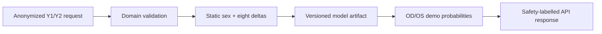
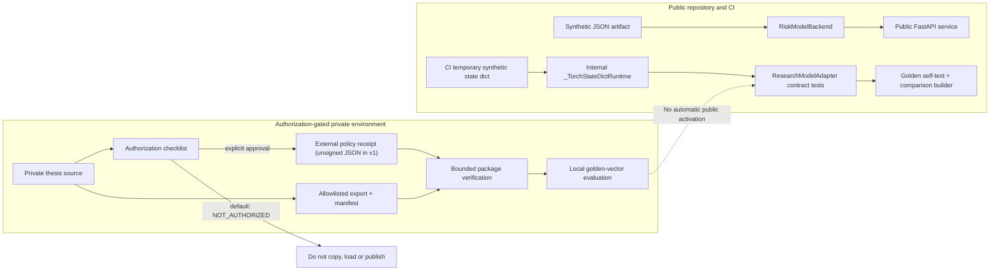
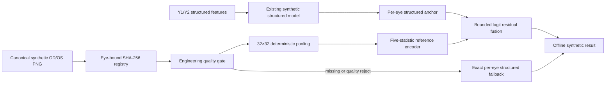

# Architecture

LongiEye 采用 contract-first 架构：公开输入契约、领域不变量、特征顺序、安全标签和 API 响应保持稳定，模型后端则通过经过校验的 artifact 接口替换。

## Design decisions

1. **Domain validation is framework-independent.** The same rules serve CLI, tests and FastAPI.
2. **Feature order is a hard contract.** A model artifact with another order is rejected at load time.
3. **Inference is inspectable.** The first milestone uses JSON coefficients rather than an opaque binary checkpoint.
4. **No direct identifiers are accepted.** `case_id` is an optional caller-owned alias and must not contain personal information.
5. **Research and demo metrics stay separate.** The synthetic model demonstrates engineering only.
6. **Trace IDs are end-to-end.** One safe ID links the response header, body and JSON log.
7. **Logs are metadata-only.** Request bodies, clinical values and caller case aliases are excluded.

## Sprint 2 adapter and authorization boundary

Phase A introduces a `RiskModelBackend` protocol, a manifest-validating `ResearchModelAdapter` and a lazy optional internal `_TorchStateDictRuntime`. The runtime has no public byte-loading factory and is constructed only from the verified-package result. Public tests create a deterministic synthetic PyTorch state dict only inside a temporary directory. A package cannot approve itself: loading also requires a package-external `ApprovalPolicy` whose receipt binds the complete canonical manifest, loader contract version, source commit plus artifact, preprocessing, model-card and golden-case hashes. The loader then enforces an exact three-file inventory, bounded regular files and one-time byte reads before deserialization. The default FastAPI process continues to load the synthetic JSON backend, and `RiskPredictionService` rejects any non-`demo_synthetic` stage.

Phase B may evaluate an approved research export only in the location and scope named by the [authorization record](RESEARCH_ARTIFACT_AUTHORIZATION.md). The current generic comparison builder reports contract checks plus already-loaded sequential latency, but it is not an authorization security boundary; only the standard CLI guarantees it first received a package from `ResearchModelAdapter.from_package`. The report says this explicitly. It does not claim source-runtime parity, cold-load/resource measurements or model quality; both metric namespaces remain explicitly unavailable. Those broader evidence classes require separate, authorized Phase B work.

An empty or unauthorized research section stays explicitly unavailable. Values from another experiment or from the synthetic model must never be copied into it. SHA-256 verifies byte-level integrity only; authorization trust comes from the external policy/receipt location, which is still not a digital signature unless an institutional signer is implemented.

## Sprint 3 synthetic multimodal boundary

The image path is deliberately separate from `app/main.py` and `RiskPredictionService`. The core decoder receives bounded bytes, not a path, URL or HTTP body. It accepts only the repository's small canonical PNG subset and rejects metadata, additional chunks, nonzero filters, invalid CRCs, decompression overrun and OD/OS digest mismatches. Public artifact policy denies other common raster and medical-image extensions.

`DeterministicFundusEncoder` is an inspectable statistics adapter, not a trained CNN. `StructuredAnchoredFusionAdapter` keeps the existing nine-feature synthetic score as the anchor and applies at most `0.35` logit adjustment. A missing or quality-rejected eye returns the original value exactly. Provenance, eye mapping or preprocessing substitution fails closed. Encoder contract failure is isolated for the current eye and then makes the image component not-ready for later requests.

The tracked pictures are generated from fixed integer drawing instructions and show a visible `SYNTHETIC OD/OS` label. Their purpose is to exercise engineering contracts and fallback behavior. The [multimodal demo card](MULTIMODAL_DEMO_CARD.md) records hashes, limitations and reproducible commands.

## Error paths and readiness

- Schema violations return a structured `request_validation_error` with no submitted value.
- Domain invariant violations return `domain_validation_error`.
- Unexpected failures return a generic `internal_server_error`; logs contain only the exception type.
- `/health` is a process liveness view; `/ready` confirms that the validated model artifact was loaded during startup.

## Current non-production gaps

The service has no authentication, rate limiting, persistent audit store, reverse-proxy configuration, concurrent capacity test, real drift monitoring, external validation or clinical governance approval. These omissions are explicit so the engineering demo is not mistaken for a deployable medical product.

## Next architecture milestones

- Export a locked research model through a documented adapter after authorization.
- Design a separately authorized real-image contract only if governance and evaluation evidence become available.
- Extend the existing structured logs with aggregated latency histograms and drift summaries.
- Add calibration and subgroup evaluation reports before any real-world pilot.
