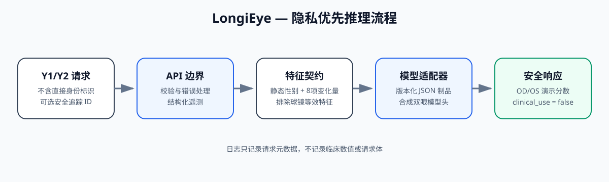
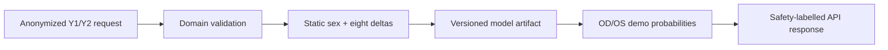

# Architecture

LongiEye 采用 contract-first 架构：公开输入契约、领域不变量、特征顺序、安全标签和 API 响应保持稳定，模型后端则通过经过校验的 artifact 接口替换。

## Design decisions

1. **Domain validation is framework-independent.** The same rules serve CLI, tests and FastAPI.
2. **Feature order is a hard contract.** A model artifact with another order is rejected at load time.
3. **Inference is inspectable.** The first milestone uses JSON coefficients rather than an opaque binary checkpoint.
4. **No direct identifiers are accepted.** `case_id` is an optional caller-owned alias and must not contain personal information.
5. **Research and demo metrics stay separate.** The synthetic model demonstrates engineering only.
6. **Trace IDs are end-to-end.** One safe ID links the response header, body and JSON log.
7. **Logs are metadata-only.** Request bodies, clinical values and caller case aliases are excluded.

## Error paths and readiness

- Schema violations return a structured `request_validation_error` with no submitted value.
- Domain invariant violations return `domain_validation_error`.
- Unexpected failures return a generic `internal_server_error`; logs contain only the exception type.
- `/health` is a process liveness view; `/ready` confirms that the validated model artifact was loaded during startup.

## Current non-production gaps

The service has no authentication, rate limiting, persistent audit store, reverse-proxy configuration, concurrent capacity test, real drift monitoring, external validation or clinical governance approval. These omissions are explicit so the engineering demo is not mistaken for a deployable medical product.

## Next architecture milestones

- Export a locked research model through a documented adapter after authorization.
- Add an image-quality gate and bilateral image encoder interface.
- Add structured logging, latency histograms and drift summaries.
- Add calibration and subgroup evaluation reports before any real-world pilot.
